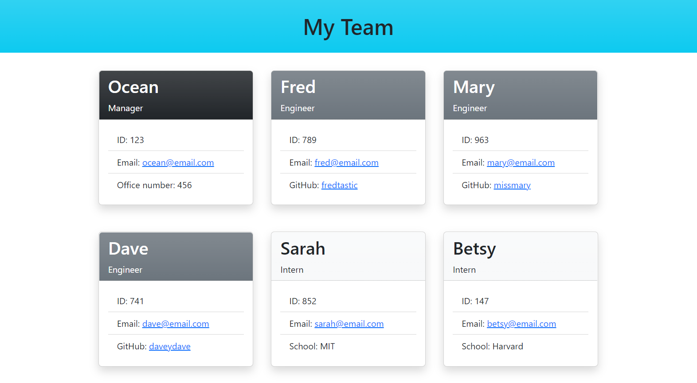

# Team Profile Generator

## Description

This Node.js application is to be used by team managers in order to keep team member information in an easy to read web page. Using Inquirer.js this application will capture user input for employees on a software engineering team and display summaries for each person in a generated HTML file. 

## Built With

* JavaScript
* Node.js
* Inquirer npm package
* Jest testing
* HTML
* Bootstrap

## Installation
> npm i

## Usage
Find the [Demonstration Video](https://drive.google.com/file/d/1epC2MvLgPoVaYGMUNm6Fv-nSFXwKbDx7/view) here!  

This application is intended for other developers to use via IDE or terminal. Once installation is completed please type the following to get started:
> node index.js

## Contributors
A big thank you to my wonderful tutor, Carlin Shaw, for helping me with questions about Jest testing and his overall encouragement!